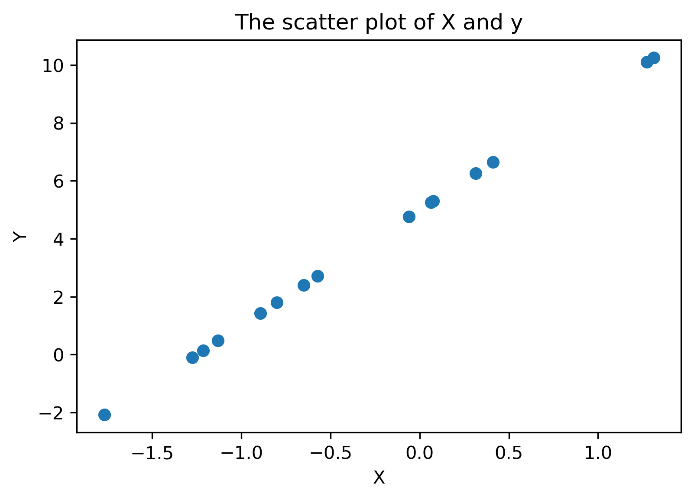
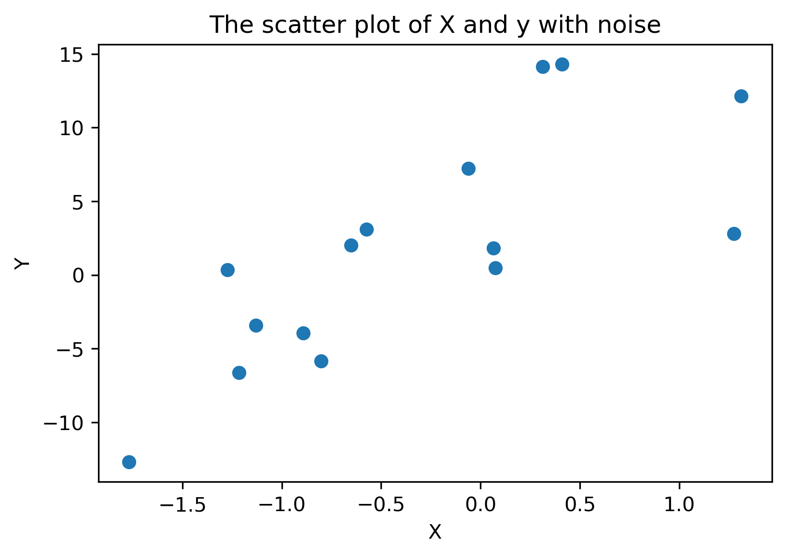
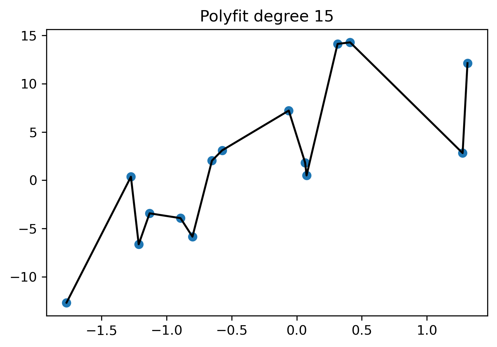
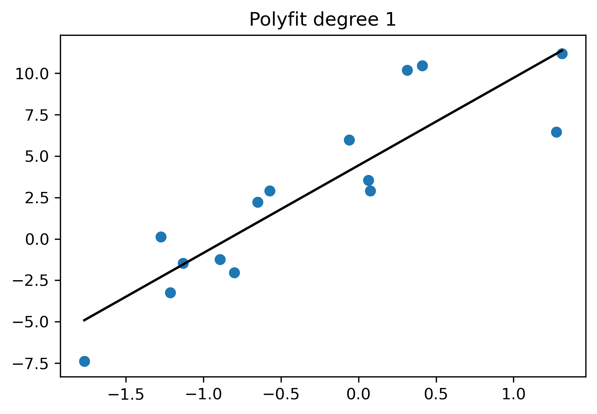
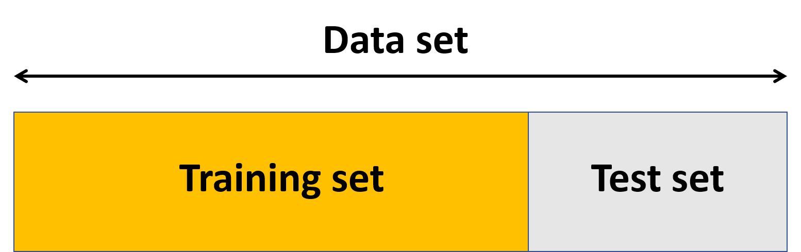
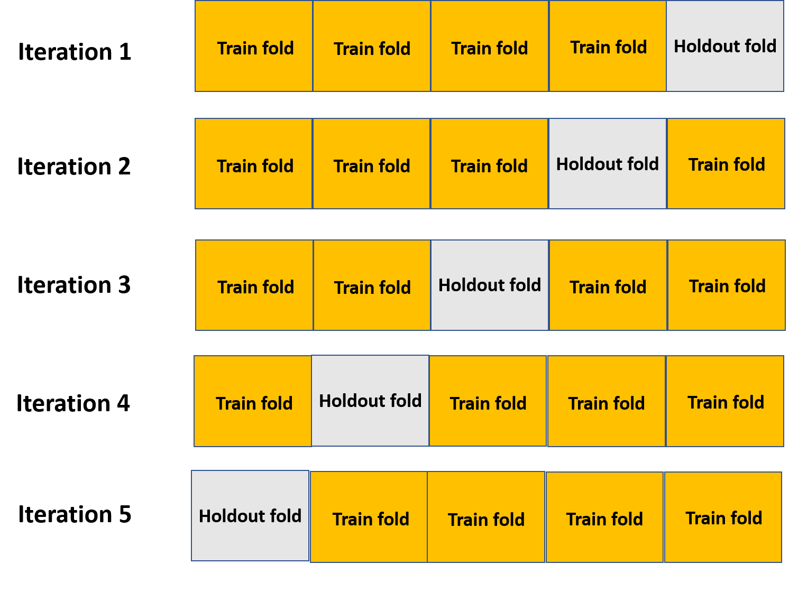
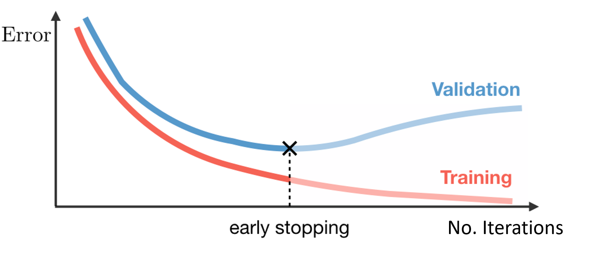

### What is overfitting? Why should we care about it? How to spot and prevent it?

This article will talk about one of the most common mistakes that thousands of beginner data scientists commit. Can you guess what it can be? Yes, you are right; it is an overfitting problem that is one of the trickiest impediments in applied machine learning. 

Sit tight and grab a cup of coffee because, in this post, I will explain what is overfitting, why we should avoid it, and how we can spot and fix it. By the end of this post, you would be able to spot overfitting in your model and deal with it.

**Table of Contents**
1. What is Overfitting
2. How to Detect Overfitting
3. How to Prevent overfitting

#### What is overfitting:

Let’s start explaining overfitting with an example. Imagine we want to build a model to classify images as either containing a dog or cat. We train our model using 20,000 images with their labels (whether the image includes dog or cat). Then, we try our model on the original images (20,000), and we get an accuracy of 97%. 

GREAT! We are the best Data Scientists in the field. 

However, the bad news is:

We try this model on new images (unseen) of cats and dogs, and we only achieve 40% accuracy. This difference between our model’s accuracy on the training data set and the unseen one means our trained model does not generalize well from our training data to unseen data.

This problem that our model does not generalize well to the unseen data is called overfitting in the data science community. Arguably, the primary purpose of Machine learning models is to generalize well. So, we have to be able to spot overfitting and deal with it.

Before explaining how you can spot overfitting, let’s look at another simple example to explain overfitting visually.

First, I make a dummy data set. 

``` python
import numpy as np
import matplotlib.pyplot as plt
np.random.seed(2020)
X = np.sort(np.random.randn(15))
y = 4 * X + 5
plt.scatter(X,y);
plt.title("The scatter plot of X and y");
plt.xlabel("X");
plt.ylabel("Y");
```


We generated simple linear data. Then, I will add random noise to the data set.
```python
np.random.seed(2020)
y = y  +  3 * np.random.randn(15)
plt.scatter(X,y)
plt.title("The scatter plot of X and y with noise");
plt.xlabel("X");
plt.ylabel("Y");
```

Let's say we want to extract the underlying trend in the data. We will fit a polynomial line with degree 15, and we would get the following result.

```python
coefs = np.polyfit(X, y, 15);
plt.figure();
plt.plot(X, np.polyval(coefs, X), color="black");
plt.title("Polyfit degree "+str(15));
plt.scatter(X,y);
plt.show();
```

We were able to fit a line that goes through every single point (observation). Here is a question for you. Does this line generalize well on a new data set, or is this line capturing the real trend in the data?  The answer to both questions is NOT. Overfitting happens when the model extracts the internal details from training data specific to that data set (In this dummy data set noise). In this example, the line respect the noise in the data set rather than the original linear relationship between X and y. Then, we fit a linear line through data, and we get the following plot.
```python
coefs = np.polyfit(X, y, 1);
plt.figure();
plt.plot(X, np.polyval(coefs, X), color="black");
plt.title("Polyfit degree "+str(1));
plt.scatter(X,y);
plt.show();
```


Here we can see that the line captured the linear relationship between X and y, and this model can be used for prediction on a new data set. Now that you understand overfitting and why it is crucial to deal with it. In the next section, I will explain how we can detect overfitting.

### 2.How to Detect Overfitting

The problem with overfitting is that we do not know how our model performs on new data before testing it. We can split our training data into two subsets, train and test set, to solve this problem.



We use a training subset to train our model. After we feel 100% confident about our model, we evaluate the model performance on our test subset. In a simple word, we consider the test subset as new unseen data. This method can help us to approximate how well our model would perform on a new data set.

** "If the our model's performance proceeding the training set is much better than on the test set, we are likely having an overfitting problem"**

For example, if our model saw 97% accuracy on the training set but only 50% on the test set, it would be an indicator of overfitting. In the next section, we will look at some of the most common techniques for solving overfitting.

### 3.How to prevent overfitting:

There are several solutions for overfitting. In this section, we will briefly explain some of the most common ones.

#### Cross-validation

Cross-validation is a powerful method to prevent overfitting. The idea is straightforward and intelligent. We split the original training data set into multiple mini train-test splits. The most common cross-validation technique is called k-fold cross-validation. In k-fold cross-validation, we divide the train data into k equal subsets. These subsets are called folds. We train our model on k-1 folds while keeping one fold as a validation set to check the model performance. This validation fold is called the holdout fold. We repeat this process k times by moving the handout fold. This way, each "fold" gets a turn at being the validation set. The following figure shows the schematic of k-fold cross-validation for a 5-fold case.



#### Early Stopping

Early stopping can only be applied to the iterative machine learning models such as [logistic regressions with gradient descent](https://towardsdatascience.com/gradient-descent-training-with-logistic-regression-c5516f5344f7) and [neural networks](https://en.wikipedia.org/wiki/Artificial_neural_network) to prevent overfitting. Let's explain what happens to train and test errors as we increase the number of iterations. The training error constantly keeps decreasing as we increase the number of iterations. As we increase the number of iterations, the model captures the train set's internal details and more prone to overfitting. On the contrary, the test error decreases up to a point and then starts to decrease again. Early stopping means that stopping the training process before that point.



#### Regularization

In this post, we define regularization, but we are not going into the mathematical definition of regularization or implementing it. It is a broad topic, and it is outside the scope of this post. f you are interested in learning about you can check this post 
[Regularization in Machine Learning](https://towardsdatascience.com/regularization-in-machine-learning-76441ddcf99a). In summary, regularization is a technique that forces the model to be simpler to avoid overfitting.

### Summary 

Overfitting happens when the model does not generalize well. Splitting data into train and test splits can help us to spot overfitting. Besides,  there are several techniques for solving overfittings, such as cross-validation, early-stopping, and regularization.
